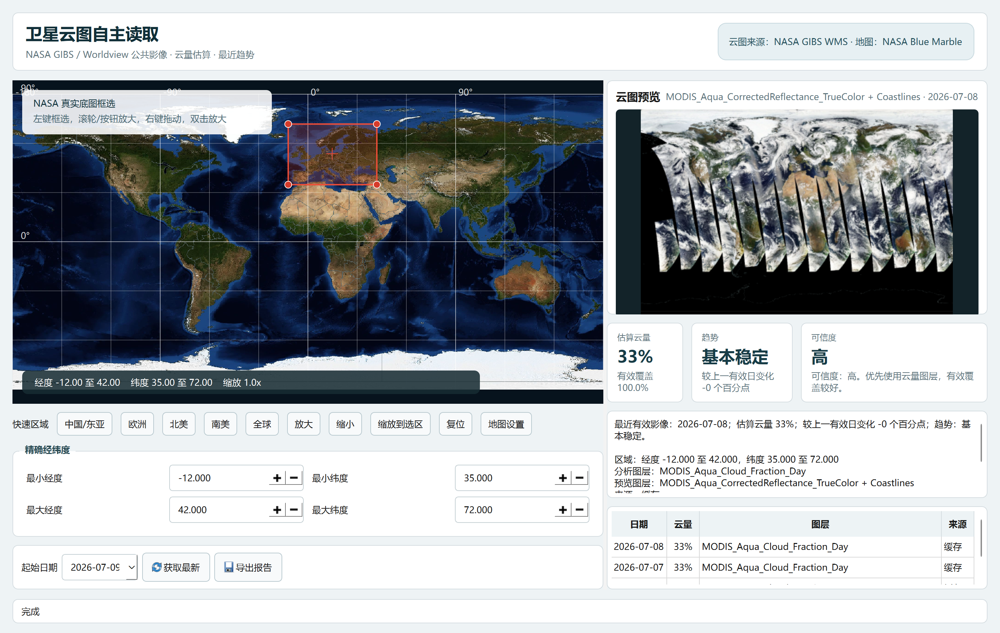
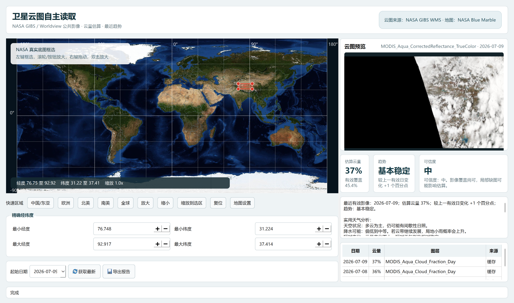

# 卫星云图自主读取

一个面向 Windows 的 NASA 卫星云图桌面分析工具。它通过 NASA GIBS / Worldview 公共影像获取指定区域的近期云图，估算云量、对比多日趋势，并给出便于快速判读的天气与出行参考。

> [!IMPORTANT]
> 本项目基于卫星影像做启发式估算，不能替代气象站观测、雷达产品、数值预报或官方天气预警。

## 界面预览

### 区域选择与云图分析

在全球地图上框选区域，程序会显示最新可用云图、估算云量、趋势、可信度和近期影像记录。



### 局部区域与天气建议

支持缩放到较小区域，并根据云量和近期变化生成天空状况、降水可能、出行、户外活动及晾晒建议。



## 主要功能

- 从 NASA GIBS WMS 自动获取近期可用的 MODIS Aqua / Terra 影像
- 在 NASA Blue Marble 全球底图上拖动框选、缩放和平移
- 提供中国/东亚、欧洲、北美、南美和全球快捷区域
- 支持直接输入经纬度，精确选择目标区域
- 估算区域云量、有效影像覆盖率及结果可信度
- 对比最近多日有效影像，判断云量变化趋势
- 生成天空状况、降水可能和生活场景建议
- 缓存已下载影像，减少重复网络请求
- 导出云图图片和文字分析报告
- 可选接入 Google Maps 作为交互地图

## 环境要求

- Windows 10 / 11
- Python 3.12
- 可访问 NASA GIBS 服务的网络连接
- Google Maps API Key（可选，仅在切换到 Google 地图时需要）

## 快速开始

### 一键运行

1. 安装 [Python 3.12](https://www.python.org/downloads/)；安装时勾选 **Add Python to PATH**。
2. 下载或克隆本仓库：

   ```powershell
   git clone git@github.com:MARINAOVO/satellite-claude-picture.git
   cd satellite-claude-picture
   ```

3. 双击 `run.bat`，或在 PowerShell 中运行：

   ```powershell
   .\run.ps1
   ```

首次运行会自动创建 `.venv` 并安装依赖，之后将直接启动程序。

如果 PowerShell 阻止脚本执行，可使用：

```powershell
powershell -NoProfile -ExecutionPolicy Bypass -File .\run.ps1
```

只安装环境而不启动程序：

```powershell
.\install.ps1
```

## 使用流程

1. **选择区域**：在地图上按住左键拖动框选，或使用快捷区域。滚轮用于缩放，右键或中键拖动用于平移。
2. **调整范围**：使用“放大”“缩小”“缩放到选区”“复位”，也可以直接填写经纬度边界。
3. **选择日期**：程序将从所选日期开始向前查找最近可用的 NASA 影像。
4. **获取数据**：点击“获取最新”，等待云图、云量、趋势和可信度分析完成。
5. **查看建议**：结合原始云图、有效覆盖率与天气建议进行人工判断。
6. **导出结果**：点击“导出报告”，结果会写入 `reports/`。

## 数据源与图层

云图来自 [NASA GIBS WMS](https://gibs.earthdata.nasa.gov/wms/epsg4326/best/wms.cgi)，无需 API Key。接口说明见 [NASA GIBS API 文档](https://nasa-gibs.github.io/gibs-api-docs/)。

程序默认依次尝试以下图层：

1. `MODIS_Aqua_Cloud_Fraction_Day`
2. `MODIS_Terra_Cloud_Fraction_Day`
3. `MODIS_Aqua_CorrectedReflectance_TrueColor`
4. `MODIS_Terra_CorrectedReflectance_TrueColor`

云量图层优先用于数值估算，真彩色图层用于影像预览和人工判读。受卫星过境、图层发布时间、夜间观测、局部缺图等因素影响，所选日期不一定存在完整影像，程序会自动回溯近期数据。

## Google 地图配置（可选）

默认 NASA Blue Marble 底图无需配置。若需要 Google 地图，可通过以下任一方式提供自己的 Maps JavaScript API Key：

在界面中的 `Google Maps API Key` 输入框填写 Key，然后点击“应用地图”；或编辑 `config.json`：

```json
{
  "google_maps_api_key": "你的 Key"
}
```

也可以临时使用环境变量：

```powershell
$env:GOOGLE_MAPS_API_KEY="你的 Key"
.\run.bat
```

Key 为空、无效或 Google 网络访问失败时，程序会继续使用 NASA Blue Marble，不影响云图下载和分析。

> [!CAUTION]
> 不要把真实 API Key 提交到公开仓库。建议优先使用环境变量，并为 Key 设置来源、API 和用量限制。

## 配置说明

`config.json` 可调整默认区域、趋势天数、稳定阈值、图层顺序和下载图片尺寸。主要字段如下：

| 字段 | 作用 |
| --- | --- |
| `default_bbox` | 默认经纬度范围 `[最小经度, 最小纬度, 最大经度, 最大纬度]` |
| `lookback_days` | 查找可用影像时向前回溯的天数 |
| `trend_count` | 趋势分析使用的有效影像数量 |
| `stable_threshold_percent` | 判定云量“基本稳定”的变化阈值 |
| `cloud_layers` | 云量分析图层及尝试顺序 |
| `preview_layers` | 真彩色预览图层及尝试顺序 |
| `image_width` / `image_height` | 请求影像的像素尺寸 |
| `google_maps_api_key` | 可选 Google Maps API Key |

## 项目结构

```text
.
├─ app.py                         # 程序入口
├─ src/satellite_cloud_reader/
│  ├─ ui.py                       # 桌面界面
│  ├─ gibs_client.py              # NASA GIBS 请求与缓存
│  ├─ analysis.py                 # 云量、覆盖率和趋势分析
│  ├─ map_widget.py               # NASA 底图组件
│  ├─ google_map_widget.py        # Google 地图组件
│  ├─ reporting.py                # 报告导出
│  └─ config.py                   # 配置读取
├─ tests/                         # 自动化测试
├─ cache/                         # 运行时影像缓存（默认不提交）
├─ reports/                       # 导出报告及 README 示例图
└─ config.json                    # 默认配置
```

## 测试

安装开发依赖后运行：

```powershell
.\.venv\Scripts\python.exe -m pytest -q
```

## 打包为 EXE

```powershell
.\build_exe.bat
```

构建结果会生成在 `dist/` 目录。首次在新环境打包前，请先运行 `install.ps1` 安装依赖。

## 已知限制

- 云量是基于像素与覆盖率的近似估算，不表示地面实测云量。
- 真彩色影像可能出现轨道拼接缝、黑色无数据区域或局部缺图。
- 卫星影像存在发布时间延迟，不适合分钟级临近预警。
- 降水判断是辅助建议，未融合雷达、数值预报和地面观测。
- 高纬度、跨越 180° 经线或极小选区可能需要手动调整经纬度。

## License

当前仓库尚未声明开源许可证。在添加许可证前，代码版权归仓库所有者保留。
